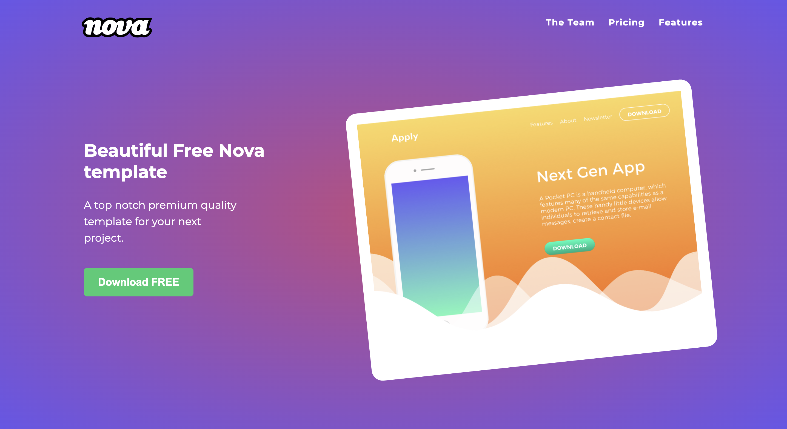

# Project task-01 - website build from mockup

See the live version of [website build from mockup](https://code-mike-code.github.io/nova-landing-page/).

Project made as a task during learning process with my mentor program [devmentor.pl](https://devmentor.pl/). This project showcases a solid foundation in HTML5 semantics, ensuring clean and accessible markup that complies with modern web standards. It incorporates CSS3 basics to deliver visually appealing styles while maintaining simplicity and efficiency. Additionally, the BEM methodology is employed to organize and structure the CSS, enabling modularity and maintainable code.

**Main features**:
- HTML5 semantics
- CSS3 basics
- BEM methodology

&nbsp;
 
## 💡 Technologies

&nbsp;
 
## 🔗 See also

Are you interested in **SCSS** and **JavaScript**? See my other project [Landing Page MGUU](https://code-mike-code.github.io/landing_page_project/).

&nbsp;
 
## 💿 Installation

No Required

&nbsp;

## 💭 Conclusions for future projects

For future projects, it is essential to prioritize the use of the BEM (Block Element Modifier) methodology to ensure a modular and maintainable CSS structure. Additionally, focusing on Responsive Web Design (RWD) principles will improve adaptability across various devices, enhancing user experience. Combining these approaches will streamline development workflows and ensure scalable, user-centric solutions.

&nbsp;

## 🙋‍♂️ Feel free to Reach Out!
If you have questions, ideas, or just want to chat about code (or the meaning of life), don’t hesitate to contact me. Open an issue, drop me a pull request, or send a message—carrier pigeon works too, but GitHub might be faster. Let’s build something awesome together! 🚀

&nbsp;

## 👏 Thanks / Special thanks / Credits
Thanks to my [Mentor - devmentor.pl](https://devmentor.pl/) – for providing me with this task and for code review.
